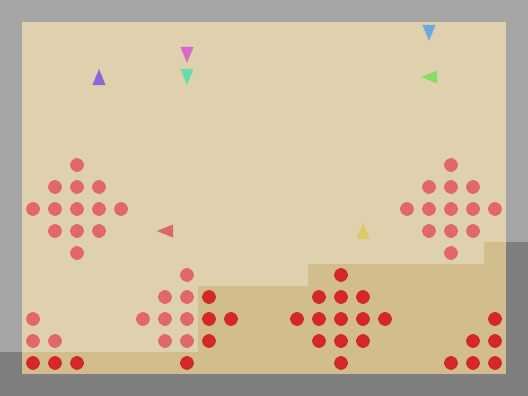
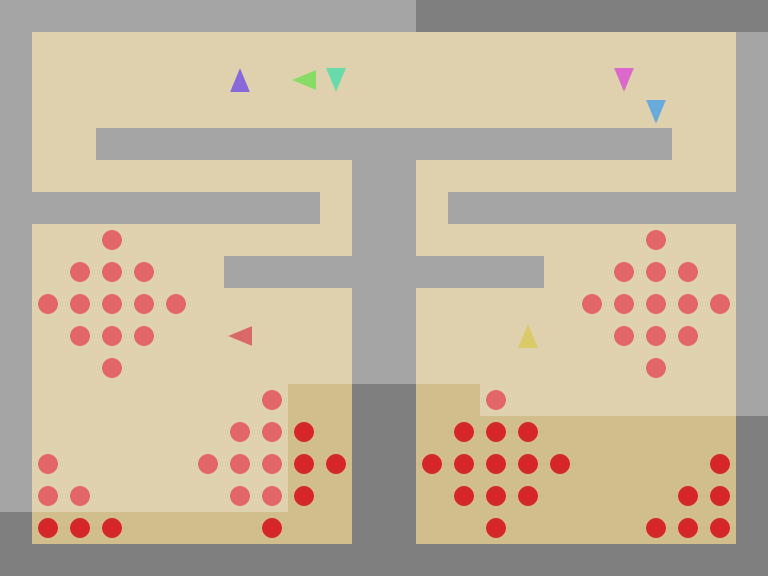
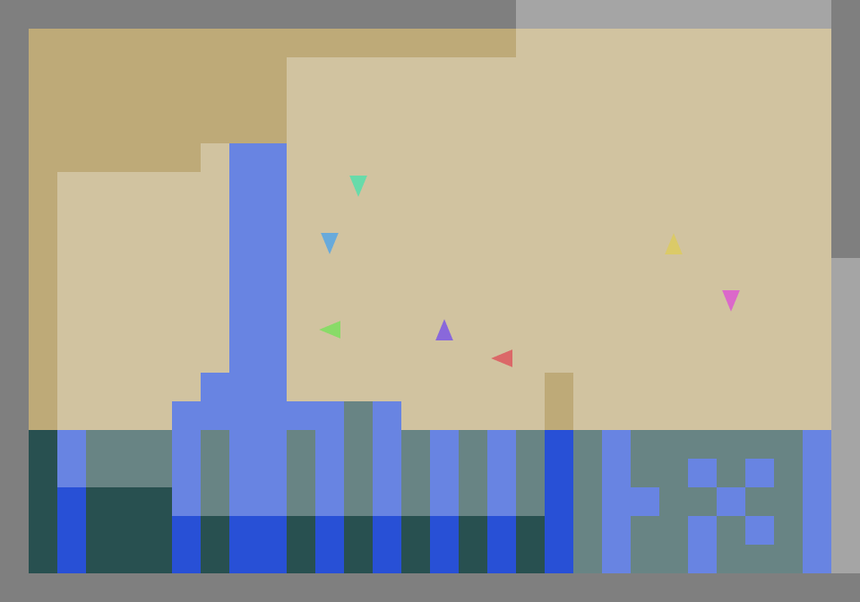
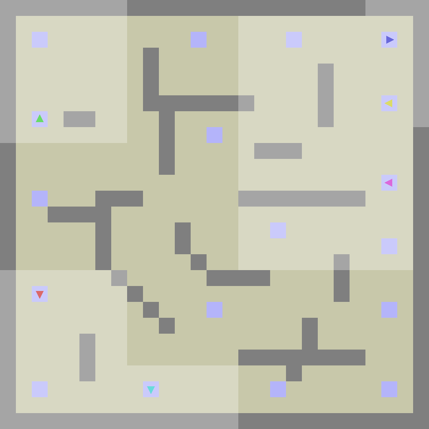

<h1 align="center">SocialJax</h1>


<p align="center">
  <a href="https://arxiv.org/abs/2503.14576">
    </a>
  <a href="https://github.com/cooperativex/SocialJax/blob/main/LICENSE">
    </a>
  <a href="https://github.com/cooperativex/SocialJax/actions/workflows/speet_example.yml">
    </a>
  <a href="https://iclr.cc/virtual/2026/poster/10009567">
    </a>
</p>

> 🎉 **SocialJax has been accepted at ICLR 2026!**

*A suite of sequential social dilemma environments for multi-agent reinforcement learning in JAX*


<p align="center">
  
  
  
  
  
</p>

*Common Rewards* : a scenario where all agents share a single, unified reward signal. This approach ensures that all agents are aligned towards achieving the same objective, promoting collaboration and coordination among them.

<p align="center">
  
  
  
  
  
</p>


***Individual Rewards***: each agent is assigned its own reward, inherently encouraging selfish behavior.


SocialJax leverages JAX's high-performance GPU capabilities to accelerate multi-agent reinforcement learning in sequential social dilemmas. We are committed to providing a more efficient and diverse suite of environments for studying social dilemmas. We provide JAX implementations of the following environments: Coins, Commons Harvest: Open, Commons Harvest: Closed, Clean Up, Territory, and Coop Mining, which are derived from [Melting Pot 2.0](https://github.com/google-deepmind/meltingpot/) and feature commonly studied mixed incentives.


Our [blog](https://sites.google.com/view/socialjax/home) presents more details and analysis on agents' policy and performance.


## Installation

First: Clone the repository
```bash
git clone https://github.com/cooperativex/SocialJax.git
cd SocialJax
```


Second: Environment Setup.

Option one: Using poetry, make sure you have python 3.10
  1. Install Poetry
       ```bash
       curl -sSL https://install.python-poetry.org | python3 -
       export PATH="$HOME/.local/bin:$PATH"
       ```

  2. Install requirements
       ```bash
       poetry install --no-root
       ```
       ```bash
       export PYTHONPATH=./socialjax:$PYTHONPATH
       ```
  3. Run code
       ```bash
       poetry run python algorithms/train.py --algo IPPO --env coins
       ```

Option two: conda with requirements.txt
  1. Conda
       ```bash
       conda create -n SocialJax python=3.10
       conda activate SocialJax
       ```

  2. Install requirements
       ```bash
       pip install -r requirements.txt
       ```
       ```bash
       export PYTHONPATH=./socialjax:$PYTHONPATH
       ```

  3. Run code
       ```bash
       python algorithms/train.py --algo IPPO --env coins
       ```

Option three: conda with environments.yml

  1. Install requirements
       ```bash
       conda env create -f environment.yml
       ```
       ```bash
       export PYTHONPATH=./socialjax:$PYTHONPATH
       ```

  2. Run code
       ```bash
       python algorithms/train.py --algo IPPO --env coins
       ```

## Training

All training is launched through a single entry point that dispatches by `--algo` and `--env`:

```bash
python algorithms/train.py --algo <ALGO> --env <ENV> [HYDRA_OVERRIDES...]
```

`--algo` selects the algorithm family; `--env` selects the per-env config (resolving to
`algorithms/<ALGO>/config/<algo>_cnn_<env>.yaml`). Anything after these two flags is
forwarded verbatim to Hydra as key=value overrides.

### Supported algorithms

| `--algo` | Description |
|---|---|
| `IPPO` | Independent PPO |
| `SVO` | Social Value Orientation (PPO with SVO reward shaping) |
| `MAPPO` | Multi-Agent PPO (centralised critic) |
| `TRANSFER` | Self-interest schedule transfer |
| `VDN` | Value Decomposition Networks (Q-learning) |

### `--env` values

Env names are unified across all algorithms (the per-env yamls live in
`algorithms/<ALGO>/config/<algo>_cnn_<env>.yaml`):

| Environment | `--env` |
|---|---|
| Coins | `coins` |
| Clean Up | `cleanup` |
| Coop Mining | `coop_mining` |
| Gift | `gift` |
| Mushrooms | `mushrooms` |
| Harvest: Open | `harvest_open` |
| Harvest: Closed | `harvest_closed` |
| Harvest: Partnership | `harvest_partnership` |
| PD Arena | `pd_arena` |

### IPPO — common vs individual reward

IPPO supports two reward modes: **common** (all agents share one summed reward) and **individual** (each agent gets its own reward — selfish baseline). Pick via the `reward` Hydra group; checkpoint and wandb name automatically get a `_reward_<mode>` suffix so both variants coexist.

```bash
python algorithms/train.py --algo IPPO --env coins reward=common
python algorithms/train.py --algo IPPO --env coins reward=individual
```

### SVO — Social Value Orientation

SVO trains on individual rewards but shapes them toward a target orientation. The
strength (`svo_w`) and ideal angle (`svo_ideal_angle_degrees`) live under `ENV_KWARGS`:

```bash
python algorithms/train.py --algo SVO --env coins
python algorithms/train.py --algo SVO --env coins ENV_KWARGS.svo_w=0.5 ENV_KWARGS.svo_ideal_angle_degrees=45
```

### TRANSFER — self-interest schedule transfer

TRANSFER mixes individual rewards by a self-interest weight `s_interest` (fixed per env
in `transfer_cnn_<env>.yaml`, optionally scheduled over training). Override it inline via
`ENV_KWARGS`:

```bash
python algorithms/train.py --algo TRANSFER --env coins
python algorithms/train.py --algo TRANSFER --env pd_arena ENV_KWARGS.s_interest=0.4
```

### Hydra overrides

```bash
# Override hyperparameters
python algorithms/train.py --algo IPPO --env coins SEED=42 LR=1e-4 NUM_ENVS=128

# Multi-seed grid (Hydra multirun)
python algorithms/train.py --algo MAPPO --env cleanup -m SEED=42,52,62

# Override nested ENV_KWARGS
python algorithms/train.py --algo SVO --env coins ENV_KWARGS.svo_w=0.8

# VDN's hyperparameters live under an `alg.*` namespace
python algorithms/train.py --algo VDN --env coins alg.NUM_ENVS=32 alg.LR=1e-4

# Turn off wandb (useful for local smoke testing)
python algorithms/train.py --algo IPPO --env coins WANDB_MODE=disabled
```

## Environments

We introduce the environments and use Schelling diagrams to demonstrate whether the environments are social dilemmas. 

| Environment                  | Description                                                                                      | Schelling Diagrams Proof |
|------------------------------|--------------------------------------------------------------------------------------------------|:------------------------:|
| Coins                        | [Link](https://github.com/cooperativex/SocialJax/tree/main/socialjax/environments/coins)         |&check;                   |
| Commons Harvest: Open        | [Link](https://github.com/cooperativex/SocialJax/tree/main/socialjax/environments/common_harvest)|&check;                   |
| Commons Harvest: Closed      | [Link](https://github.com/cooperativex/SocialJax/tree/main/socialjax/environments/common_harvest)|&check;                   |
| Commons Harvest: partnership | [Link](https://github.com/cooperativex/SocialJax/tree/main/socialjax/environments/common_harvest)|&check;                   |
| Clean Up                     | [Link](https://github.com/cooperativex/SocialJax/tree/main/socialjax/environments/cleanup)       |&check;                   |
| Territory                    | [Link](https://github.com/cooperativex/SocialJax/tree/main/socialjax/environments/territory)     |&cross;                   |
| Coop Mining                  | [Link](https://github.com/cooperativex/SocialJax/tree/main/socialjax/environments/coop_mining)   |&check;                   |
| Mushrooms                    | [Link](https://github.com/cooperativex/SocialJax/tree/main/socialjax/environments/mushrooms)     |&check;                   |
| Gift Refinement              | [Link](https://github.com/cooperativex/SocialJax/tree/main/socialjax/environments/gift)          |&check;                   |
| Prisoners Dilemma: Arena     | [Link](https://github.com/cooperativex/SocialJax/tree/main/socialjax/environments/pd_arena)      |&check;                   |

#### Important Notes:
- *Due to algorithmic limitations, agents may not always learn the optimal actions. As a result, Schelling diagrams can prove that the environment is social dilemmas, but they cannot definitively prove that the environment is not social dilemmas.*

- *Territory might not be Social diagram, but as long as the agents' behaviors are interesting, Territory holds intrinsic value.*
  
## Quick Start

SocialJax interfaces follow [JaxMARL](https://github.com/FLAIROx/JaxMARL/) which takes inspiration from the [PettingZoo](https://github.com/Farama-Foundation/PettingZoo) and [Gymnax](https://github.com/RobertTLange/gymnax).

### Make an Environment
You can create an environment using the ```make``` function:
```python
import jax
import socialjax

env = make('clean_up')
```

### Example

Find more fixed policy [examples](https://github.com/cooperativex/SocialJax/tree/main/fixed_policy).

```python
import jax
import socialjax
from socialjax import make

num_agents = 7
env = make('clean_up', num_agents=num_agents)
rng = jax.random.PRNGKey(259)
rng, _rng = jax.random.split(rng)

for t in range(100):
     rng, *rngs = jax.random.split(rng, num_agents+1)
     actions = [jax.random.choice(
          rngs[a],
          a=env.action_space(0).n,
          p=jnp.array([0.1, 0.1, 0.1, 0.1, 0.1, 0.1, 0.1, 0.1, 0.1])
     ) for a in range(num_agents)]

     obs, state, reward, done, info = env.step_env(
          rng, old_state, [a for a in actions]
            )
```

### Speed test

You can test the speed of our environments by running [speed_test_random.py](https://github.com/cooperativex/SocialJax/blob/main/speed_test/speed_test_random.py) or using the [colab](https://colab.research.google.com/github/cooperativex/SocialJax/blob/main/speed_test/speed_test_random.ipynb).


## Citation

If you use SocialJax in your research, please cite:

```bibtex
@inproceedings{guo2025socialjax,
  title={{SocialJax}: An Evaluation Suite for Multi-agent Reinforcement Learning in Sequential Social Dilemmas},
  author={Guo, Zihao and Shi, Shuqing and Willis, Richard and Tomilin, Tristan and Leibo, Joel Z. and Du, Yali},
  booktitle={International Conference on Learning Representations (ICLR)},
  year={2026},
}
```


## See Also

[JaxMARL](https://github.com/flairox/jaxmarl): accelerated MARL environments with baselines in JAX.

[PureJaxRL](https://github.com/luchris429/purejaxrl): JAX implementation of PPO, and demonstration of end-to-end JAX-based RL training.
